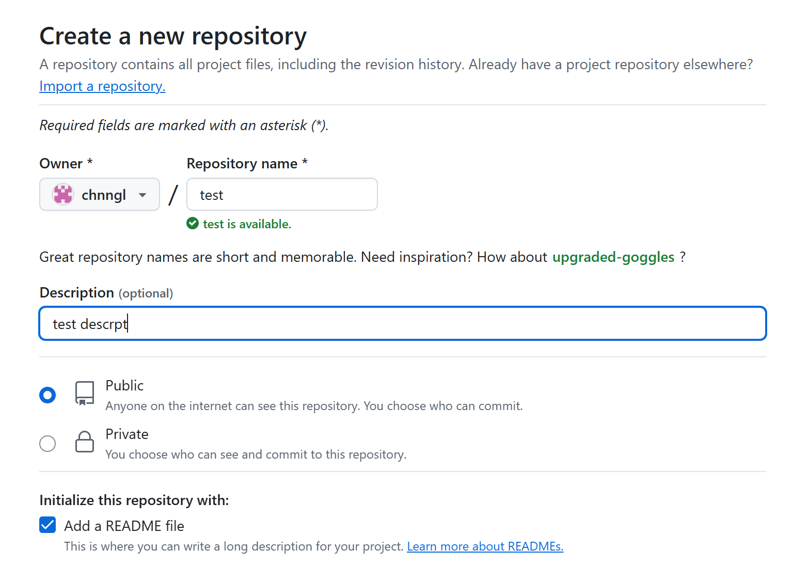
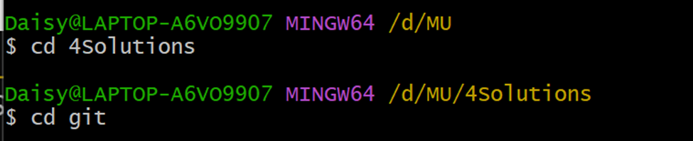
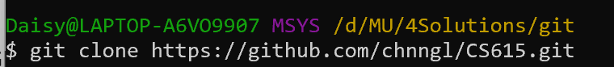
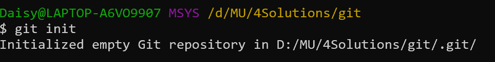
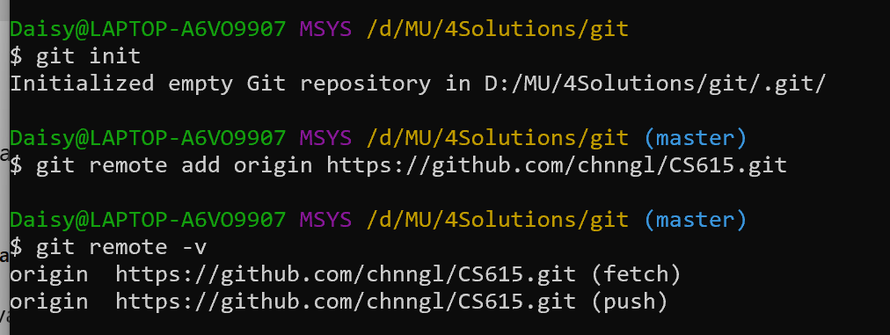
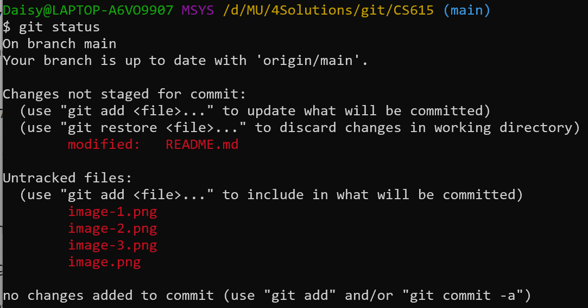
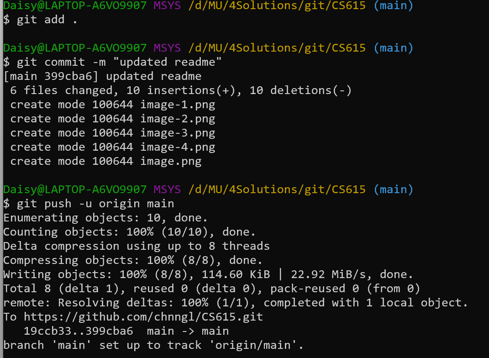
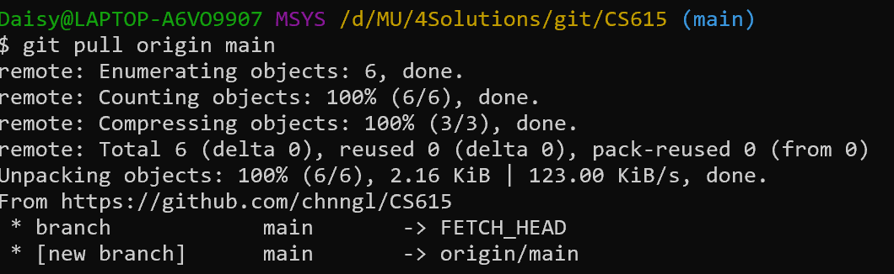

# CS615

Github Configuration Steps

Step 1: Create a New GitHub Repository

- Go to GitHub and log in.
- Click on profile icon → Select "Your repositories".
- Click the green "New" button.
- Enter a Repository Name (e.g., CS615).
- Choose Public or Private based on preference.
- Check "Add a README file" if we want a default README file.
- Click "Create repository".

Step 2: Clone the Repository to Local Machine

- Open Git Bash or terminal and navigate to the local folder: cd /path/to/folder
  
- Clone the repository to download it

Step 3: Initialize Git (if not already initialized)

- If the folder is not already a Git repository, initialize it:
  git init
  
- Add the Remote Repository. Set the remote origin to GitHub repository:
  git remote add origin https://github.com/chnngl/CS615.git
  

Step 4: Make Changes and Push Them to GitHub

- Add or modify files in local folder.
- Check which files have changed:
  git status
- Add the changes to the staging area:
  git add .
- Commit the changes with a message:
  git commit -m "Describe your changes"
- Push the changes to GitHub:
  git push -u origin main
  

Step 5: Pull the latest changes

- Pull existing files from GitHub:
  git pull origin main
  
